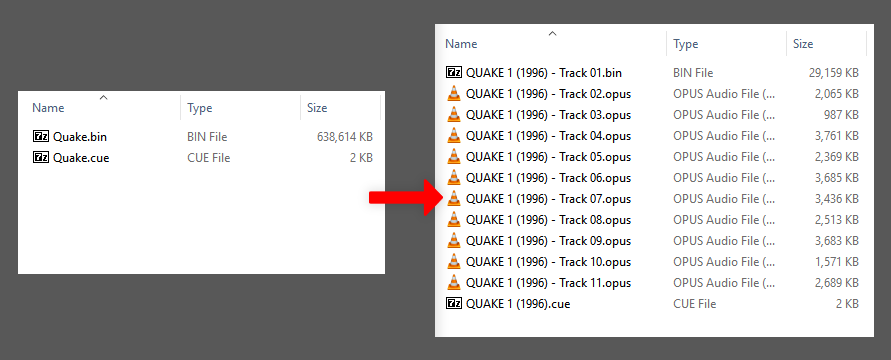

## What is it
**CBAE** (**C**ue **B**in **A**udio **E**ncoder) is a CLI tool that can encode the audio tracks of a CD image with the **cue/bin** format into OPUS, FLAC, VORBIS or MP3. The new CD Image can then be used in software that supports loading `.cue` files with encoded audio tracks (mostly emulators like DosBox).

**Features**
- Supports merged `.bin` files, it can extract the audio from those
- Generates new `.cue` files with correct parameters
- Fast encoding, tracks are encoded in parallel
- **NEW** display the SHA-1 hash of tracks


### Example


Take the original release of **"Quake (1996)"**, a single CD Image, including ten (**10**) CD-DA Tracks. Here is a size comparison between the raw image and encoded audio .cue/.bin images.

| Audio       | Audio Tracks | Data Tracks | Total Size |
| ----------- | ------------ | ----------- | ---------- |
| CD-DA       | 595MB        | 28MB        | **623MB**  |
| FLAC        | 255MB        | 28MB        | **283MB**  |
| OPUS 64Kbps | 26MB         | 28MB        | **55MB**   |

The OPUS codec produces very nice audio quality even at low bitrates. The encoded Quake CD got a reduction down to **9%** of the original raw CD size.

## Getting and Running
CBAE is a nodejs script. It is a single file and has no external dependencies other than FFmpeg. You can download the script from here or from npm.

- From NPM.
```bash
# Download and install globally
npm i cbae --location=global
# Run
cbae
```
- Or download the script manually from github
```bash
# Clone the git to a dir of your choice
git clone https://github.com/john32b/cbae --depth 1
# Run
cd cbae/bin
node cbae
```
- Or for Windows, download the Executable that does not require NodeJS
	- You can find this in the [Releases Tab in Github](https://github.com/john32b/cbae/releases)

**In Short, you need:**
- [NodeJS](https://nodejs.org), version 16+ (*or not if you are on Windows and get the standalone version*)
- [FFmpeg](http://ffmpeg.org/), set on your PATH *(So it can run from anywhere by calling ffmpeg)* 
- Some basic command line knowledge is a plus

**TIP**: For Windows the easiest way to get FFmpeg on path, is to copy `ffmpeg.exe` in your Windows dir (usually `C:\Windows`)

### Running
**Quick Examples**
```bash
# Encode all .cue cd images from H:\DOS\cdimages into b:\encoded\
# and convert audio tracks to FLAC
cbae H:/DOS/cdimages/*.cue -o b:/encoded -enc FLAC

# Encode TombRaider2.cue into the current working directory
# convert audio to Vorbis 128KBPS, using 12 parallel tasks
cbae TombRaider2.cue -o . -enc VORBIS:128 -p 12

# Print information for all cue files in current dir
cbae i *.cue
```

**For HELP and USAGE** call `cbae -help`  

**INPUT**. A valid .cue file, full path or relative path. Supports multiple inputs. 
- In Linux you can do file globbing,  `/home/janko/iso/**/*.cue`
- In Windows basic file globbing is supported,  `c:\games\cd\*.cue`
- For multiple inputs separate with space,  `game1.cue game2.cue ...`
	
**OUTPUT**. A directory where the new folders will be created. Full or relative path. 
- Set with `-o` . e.g. `cbae quake.cue -o /tmp/ ...` -- Will create `/tmp/quake [e]/`
- Newly created folders come with the postfix `[e]`, for `Encoded` 
- If you give `=src` then the output folder will be created on the base directory of the input .cue file.

**ACTION** `e` Encode, *(default)*
The main thing, takes .cue files and encodes the audio tracks to a codec of your choice<sup>\*</sup> (*more later*). Generates a new .cue file and puts all the new files in a new folder under the declared *output*
- This is the *default action* meaning, you can skip declaring it. e.g. `cbae e input.cue ...` is the same as `cbae input.cue ...`
- Example : `cbae ~/iso/TR3.cue -o =src -enc VORBIS:96` --> Will encode `TR3.cue` using Vorbis 96kbps and will put everything in `~/iso/TR3 [e]`

**ACTION** `i` Info. With this you can view some information on a .cue/.bin cd image. Filesizes and SHA-1 checksum.

**OPTION** `-p` sets the maximum number of concurrent encodes that can run. It gets a default value of 3/4 the threads of your system.

**OPTION**  `-enc` sets encoder and bitrate, given in a single parameter in the format `codec:kbps` 
- e.g. `cbae .... -enc OPUS:80` -> will use OPUS codec at 80KBPS
- e.g. `cbae .... -enc FLAC` -> will use FLAC. Notice that it doesn't require the `:KBPS` part

**OPTION** `-only {audio/data}` You can choose to work on either the `audio` or `data` tracks of the CD. This is useful when you want to extract the data track of a merged CD *`-only data`*

**Here is a list of codecs supported, along with the valid range of kbps.**

| Codec ID         | Min Kbps | Max Kbps |
| ---------------- | -------- | -------- |
| MP3              | 32       | 320      |
| MP3V<sup>*</sup> | 44       | 256      |
| OPUS             | 28       | 500      |
| VORBIS           | 64       | 500      |
| FLAC             | -        | -        |
| RAW              | -        | -        |

<sup>*: MP3 is constant bitrate, while MP3V is variable bitrate.</sup> 

> **Notes**: 
> - The `RAW` encoder can be used to split a merged .bin file to individual raw tracks.
> - Press `CTRL+C` to exit the program at any time.
> - On multiple file input, if a file fails, cbae will continue to the next file in queue.
> - If a CD Image does not include any audio tracks then it will NOT be processed at all.

**Realtime speed of converting two CDs with a bunch of audio tracks to FLAC**

 

## Um, what does CBAE do exactly?
CBAE takes a `.cue/.bin` file combo, copies the data tracks as they are, and uses FFmpeg to encode the audio tracks into separate files. Finally it produces a new `.cue` file and puts everything into a new folder.


<sup>a picture is worth a thousand words</sup>

A new `.cue` file is generated and it makes the tracks point to the new encoded audio files.

```text
FILE "QUAKE 1 (1996) - Track 01.bin" BINARY
	TRACK 01 MODE1/2352
	INDEX 01 00:00:00
FILE "QUAKE 1 (1996) - Track 02.opus" OPUS
	TRACK 02 AUDIO
	INDEX 01 00:00:00
	...
	...
FILE "QUAKE 1 (1996) - Track 11.opus" OPUS
	TRACK 11 AUDIO
	INDEX 01 00:00:00
```


## Software/Emulators that support .cue files with encoded audio files
- **DosBox-staging** supports {Flac, Opus, Vorbis, Mp3, Wav} -- https://github.com/dosbox-staging/dosbox-staging#feature-differences
- **DosBox-X** supports {Flac, Opus, Vorbis, Mp3, Wav} -- https://dosbox-x.com/wiki/DOSBox%E2%80%90X%E2%80%99s-Feature-Highlights
- **Mednafen** supports : {Vorbis, Flac, Wav} -- https://mednafen.github.io/documentation/
- **[PCSX-Redux](https://pcsx-redux.consoledev.net/)** supports anything its linked ffmpeg dependency supports.
- I'm sure there are more, *(help me expand this list?)*


## CHANGELOG

### v1.0
- The `information` action `(i)` will also display the SHA-1 checksum of all the tracks
- Can selectively work with audio/data tracks, using the `-only` option
- `RAW` encoder, meaning the audio tracks will not be encoded, they will be copied

### v0.9
- First version

---

## MORE

### What about CHD ?
CHD is an entirely different thing and from what I understand CHD can only include lossless audio plus not all programs/emulators support it.

### Wait, what about CDCRUSH ?
This older project of mine [CDCRUSH](https://github.com/john32b/cdcrush) has the functionality to encode audio tracks of a CD. But cdcrush is kinda dead now. It tried to do many things at once, and its main feature to highly compress a cd image into cold storage is *(I think)* deprecated by other archivers that allow the archives to be mounted. Perhaps not in the same compression ratios as cdcrush offered, but nonetheless ready to be accessed. Things like **squashFS** and **dwarFS** among others, they provide very good compression ratios, so for me, it makes sense to keep CD images in a compressed format that are ready to be mounted and played.

Then why not update the cdcrush code? I don't like the code, some parts are messy and others bloated, so I thought it would be better to do fresh start using pure JS *(cdcrush was written in Haxe)* while only implementing the useful stuff, which is audio encode a CD. In other words cdcrush is deprecated.

---
Made by me, **John32B** under the ISC license *(See license.txt)* 
